# AI 学习助手 - 考核项目记录文档

### 1. 初始化前后端分离项目框架
* **原始 Prompt：** “我是一个纯小白，现在需要你帮我搭建一个前后端分离的项目。
  1、请在当前目录下，帮我用 Next.js 初始化前端项目（放在 frontend 文件夹里），并配置好 Tailwind CSS。
  2、请在当前目录下，帮我初始化一个 Flask 后端项目（放在 backend 文件夹里），并帮我写好基础的启动文件。 请一步步告诉我需要能在终端运行的命令，不要跳步，等待我执行完再进行下一步。”
* **功能标注：** 初始化前端基础框架 (Next.js) 与 Flask 后端基础骨架
* **过程记录：** 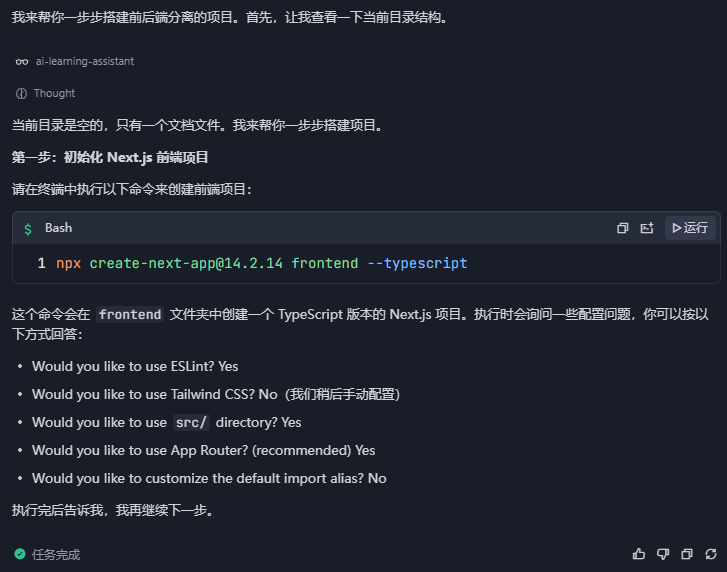

### 2. 构建后端虚拟环境
* **原始 Prompt：** “第一步我已经执行成功了，前端代码跑通了。请继续告诉我第二步初始化 Flask 后端的命令。”
* **功能标注：** 初始化 Flask 后端框架与虚拟环境 `(venv)`，隔离系统级全局 Python 依赖。
* **过程记录：** 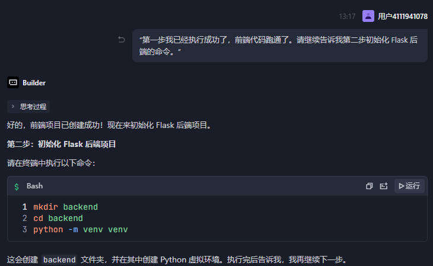 以及 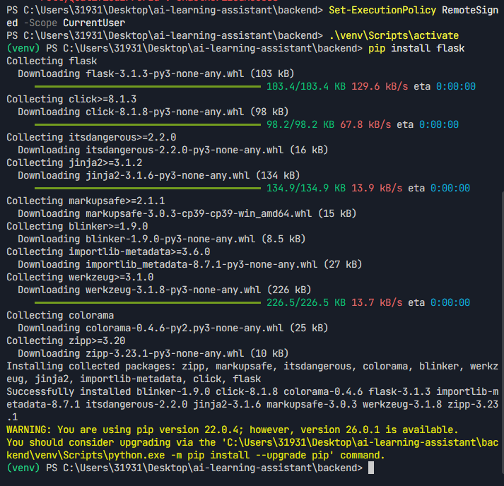

### 3. 生成后端核心接口骨架
* **原始 Prompt：** “后端环境我已经装好了。现在请接管后端开发，直接在 backend 文件夹下帮我创建 app.py，并写好 /api/login、/api/chat、/api/history 这三个 API 接口的初始代码。要求符合 Flask 规范，写完后请告诉我如何启动这个后端服务。”
* **功能标注：** 利用 AI 自动生成 Flask 后端的三个核心 API 接口骨架 (`backend/app.py`)
* **过程记录：** 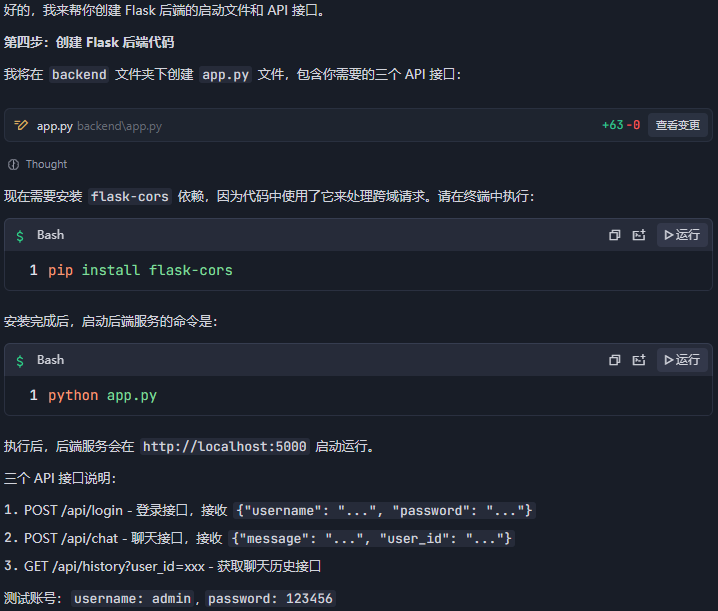

### 4. 前端高颜值首页开发
* **原始 Prompt：** 帮我编写一份极简高级感（暗黑科技风）的项目欢迎首页代码，要求完全符合 Tailwind CSS 规范。
* **功能标注：** 修改 `frontend/src/app/page.tsx`，完成项目高颜值首页 (`/`) 的 UI 界面开发
* **过程记录：** 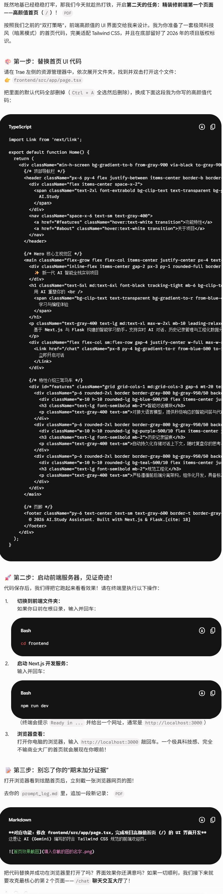 与 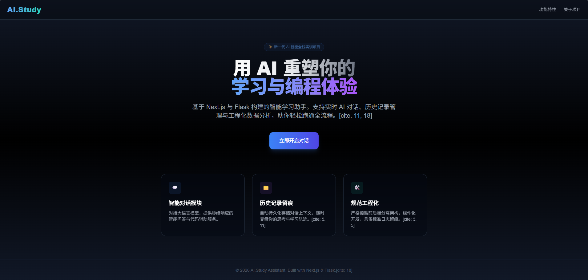

---


### 1. 前端聊天室 UI 界面精装修
* **原始 Prompt：** 帮我设计一个包含响应式侧边栏历史记录列表、ChatGPT 同款对话气泡流以及底部精美输入框的实时聊天室前端 UI 界面。
* **功能标注：** 新建 `frontend/src/app/chat/page.tsx`，完成聊天室交互大厅的 UI 界面开发与静态状态模拟调试。
* **过程记录：** 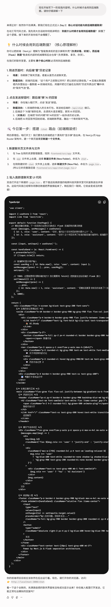 与 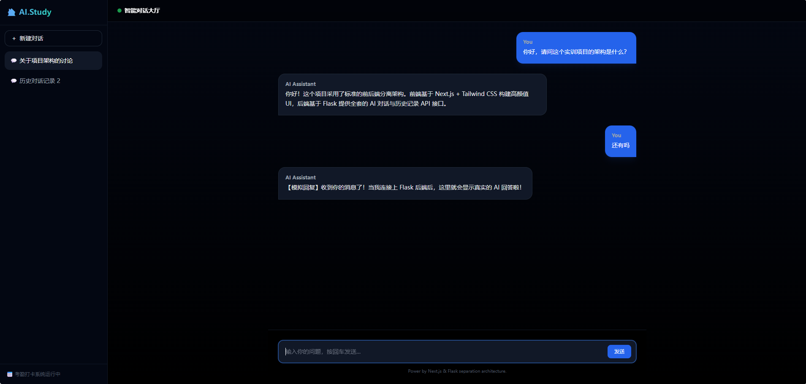

### 2. 后端真实业务逻辑与跨域配置
* **原始 Prompt：**
  “我的前端聊天页 UI 已经搭建完毕。现在请完全接管开发，帮我把后端的真实逻辑跑起来：
  1、修改 backend/app.py：实现两个真实接口：
  - /api/history (GET)：返回一个初始的历史对话列表（可以先用 Python 的数组模拟存储）。
  - /api/chat (POST)：接收前端发来的用户问题，模拟返回一个 AI 智能助手的回答，并把这轮对话存入历史记录数组中。
  2、开启跨域支持： 确保安装并配置好 flask_cors，允许前端 3000 端口访问后端的接口。
  请自动创建/修改文件并完成代码编写，写完后请告诉我，并给出在虚拟环境下启动 Flask 后端的命令。”
* **功能标注：** 修改 `backend/app.py`，实现后端真实对话接口与历史记录 API，集成跨域支持。
* **过程记录：** 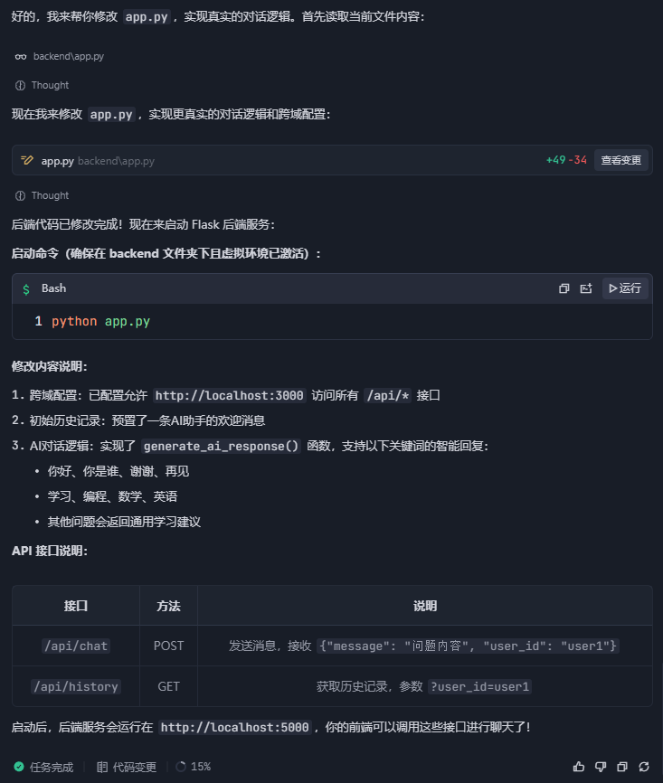

### 3. 联调报错异常处理（CORS与依赖缺失）
* **遇到问题：** 启动后端服务时，终端抛出错误 `ModuleNotFoundError: No module named 'flask_cors'`。
* **原因分析：** 虚拟环境中缺少跨域处理插件 `flask-cors`。
* **解决策略：** 保持虚拟环境激活状态，在终端执行 `pip install flask-cors` 手动补齐依赖，并成功启动后端服务。
* **过程记录：** 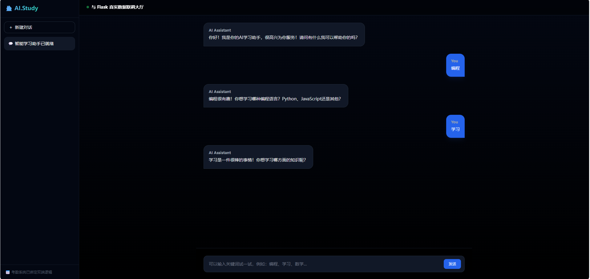 ➔ 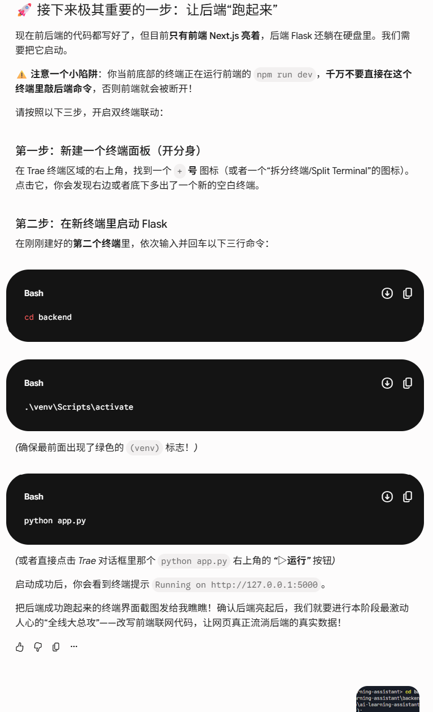

### 4. 前端后全线联调测试
* **核心工作：** 改写前端 `page.tsx` 代码，利用 `fetch` 异步请求后端的 `/api/chat` 和 `/api/history` 接口，将静态模拟数据替换为动态后端流水。
* **功能标注：** 改写 `frontend/src/app/chat/page.tsx`，完成前后端全线联调测试。
* **联调结果：** 页面首次加载能完美读取 Flask 历史记录；输入关键词（如“编程”、“学习”），能精准获得并渲染后端返回的智能答复，全数据链路彻底闭环。
* **过程记录：** 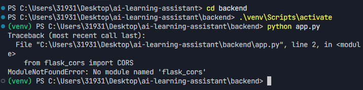 与 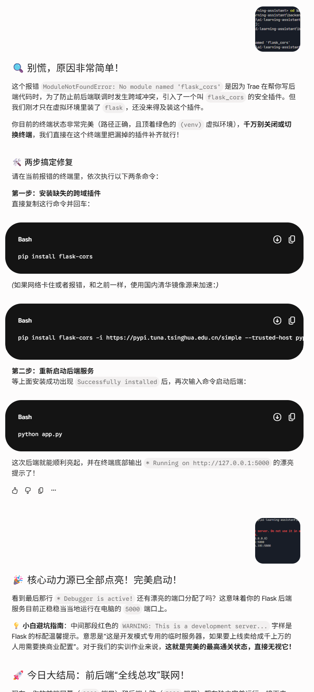

---


### 1. 内存临时存储升级为数据真持久化
* **原始 Prompt：** > “目前我们的 Flask 后端是将聊天记录存在内存数组里的，服务一重启数据就全丢了。为了提高项目的完整性和健壮性，请我升级 backend/app.py：
  > 1、引入 JSON 文件存储：在 backend 文件夹下自动维护一个 history.json 文件。
  > 2、改造 /api/history 接口：当页面加载时，从 history.json 文件中读取并返回历史记录；如果文件不存在，则初始化一个包含 AI 欢迎语的默认列表并写入文件。
  > 3、改造 /api/chat 接口：当收到用户新消息并生成 AI 回复后，将最新的对话追加到 history.json 文件中保存。
  > 4、保持跨域配置：确保 flask_cors 依然正常工作。
  > 请完全接管并自动修改代码，完成后请告诉我。”
* **功能标注：** 重构后端 I/O 模块，利用 Python 的 `json` 内置库实现非易失性文件系统级存储，防止因进程关闭导致用户数据丢失。
* **过程记录：** 后端数据持久化逻辑由 Trae 自动接管并重写成功。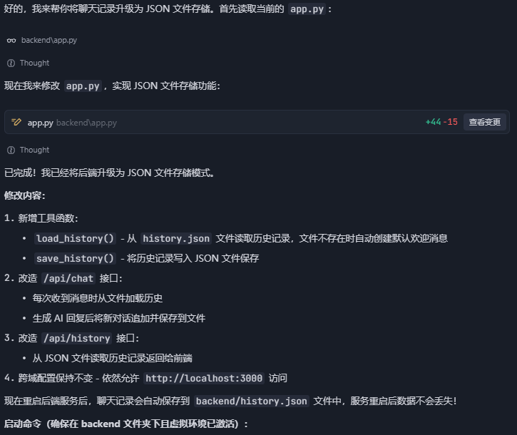 ➔ 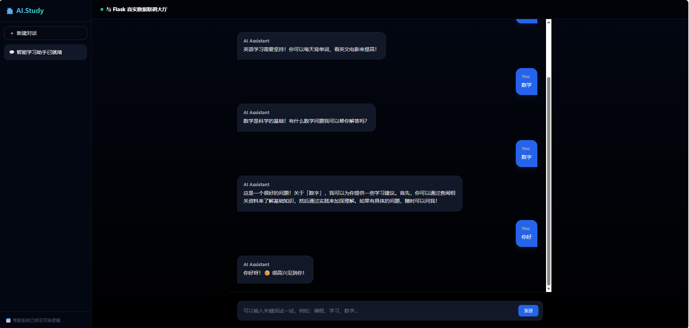+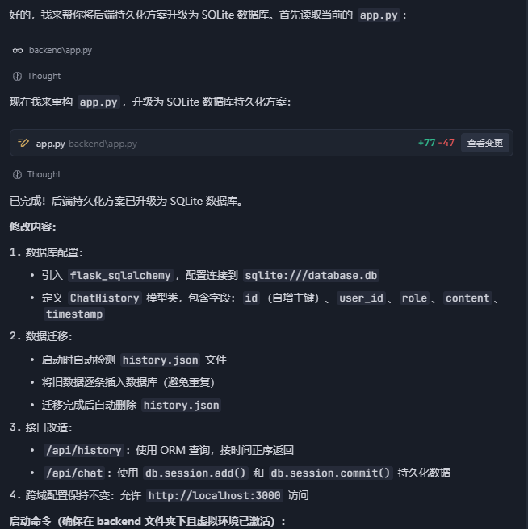

---

### 1. 克服环境底层编译冲突（安装 Flask-SQLAlchemy）
* **遇到问题：** 在安装大厂级 ORM 数据库管理工具时，终端抛出严重红字阻塞：`error: Microsoft Visual C++ 14.0 or greater is required`，导致底层依赖 `greenlet` 编译失败。
* **原因分析：** 1. 初始虚拟环境自带的包管理工具 `pip` 版本过旧，无法正确识别云端已打包好的免编译二进制文件（`.whl` 轮子包）。
  2. 传统机制下系统自动降级尝试本地编译源码，由于 Windows 环境缺乏 C++ 编译环境而直接崩溃。
* **解决策略：** 顶住压力不下载几 GB 的庞大编译工具，采取职业程序员的“强制免编译路径”。在激活的 `(venv)` 虚拟环境下，顺序执行以下三剑客命令：


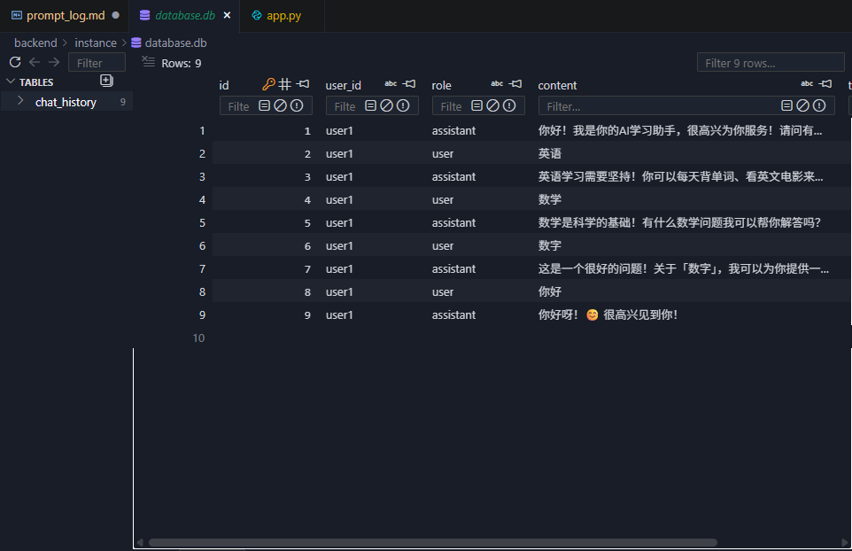

```bash
# 1. 强刷升级 pip 工具链至最新版本
python -m pip install --upgrade pip -i https://pypi.tuna.tsinghua.edu.cn/simple
# 2. 绕过本地编译，强制指定下载全现成二进制包
pip install greenlet --only-binary=:all: -i https://pypi.tuna.tsinghua.edu.cn/simple
# 3. 顺畅安装核心 ORM 框架
pip install flask-sqlalchemy -i https://pypi.tuna.tsinghua.edu.cn/simple
```


### 1. 后端智能统计接口开发（第 3 个核心 API）
* **原始 Prompt：** > “请完全接管后端开发，在 `backend/app.py` 中新增第 3 个核心 API 接口 `/api/stats` (GET)。
  > 
  > **具体要求如下：**
  > 1. **数据库真实统计**：使用 SQLAlchemy 语法查询 `ChatHistory` 表，提取以下真实数据：
  >    * `total_chats`：用户累计提问的总次数（即统计 `role='user'` 的记录总数）。
  >    * `ai_words`：AI 助手累计回复的总字数（查询所有 `role='assistant'` 的 `content` 字段的字符长度总和）。
  >    * `topic_stats`：学习主题分布统计。通过对 `content` 字段进行轻量级模糊匹配分类：
  >      - 包含 '编程'、'代码'、'python'、'写个' 归为 **“编程技术”**
  >      - 包含 '数学'、'计算'、'算术'、'公式' 归为 **“数理逻辑”**
  >      - 包含 '英语'、'单词'、'翻译'、'口语' 归为 **“语言学习”**
  >      - 其余无法识别的记录统一归为 **“综合通识”**
  >      统计这四个分类各自出现的总次数。
  > 2. **返回标准 JSON**：格式必须严格规范，结构如下：
  >    ```json
  >    {
  >      "total_chats": 12,
  >      "ai_words": 2450,
  >      "topic_stats": [
  >        { "name": "编程技术", "value": 5 },
  >        { "name": "数理逻辑", "value": 2 },
  >        { "name": "语言学习", "value": 3 },
  >        { "name": "综合通识", "value": 2 }
  >      ]
  >    }
  >    ```
  > 3. **保持系统兼容**：确保 `flask_cors` 跨域依然对该新接口生效。

  > 修改完成后请自动运行并保持后端 Flask 服务启动，谢谢！”
* **功能标注：** 在 `backend/app.py` 中新增 `/api/stats` 路由。利用 SQLAlchemy 对 SQLite 关系型数据库进行深度数据挖掘，实时聚合用户总提问数、AI总回复字数，并通过文本模糊匹配完成“学习主题分布”的分类统计。
* **调试与验证：** 后端新接口成功上线且未破坏原有逻辑。在浏览器直接请求 `http://127.0.0.1:5000/api/stats`，完美呈现出结构化的真实 JSON 统计流水。
* **过程记录：** 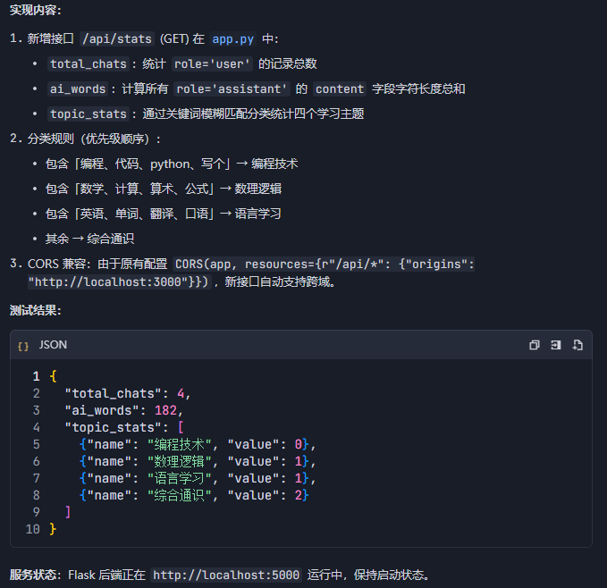 与 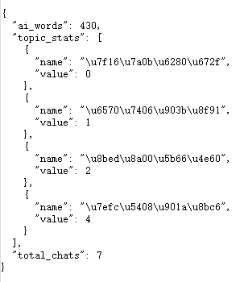


### 2. 全栈网络联调与幽灵进程强杀（真实 Debug 记录）
* **遇到问题：** 后端服务虽然显示启动，但通过浏览器或前端 `fetch` 请求 `http://localhost:3000` 或 `5000` 端口时，浏览器冷酷抛出 `ERR_CONNECTION_REFUSED`（连接被拒绝）白色报错页。
* **原因分析与人机协同排查：**
  > **User：** 我开了 Flask 服务，为什么搜 http://localhost:3000 还是进不去？我是不是没启动成功？
  > 
  > **AI：** 别慌！这是全栈开发中经典的“进程假死与网络隔离”暗坑。主要由于：
  > 1. 之前异常关闭的 Flask 幽灵进程死死霸占了 5000 端口，新服务无法正常监听。
  > 2. Windows 系统的 `localhost` 域名解析倾向于 IPv6（`::1`），与 Flask 默认的 IPv4（`127.0.0.1`）发生路由错配。
  > 3. 前端 Next.js 服务器（3000端口）尚未在独立终端内轰鸣。
* **解决策略（双端合体）：**
  1. **强杀占用**：在 PowerShell 终端执行强杀命令，彻底清空霸占 5000 端口的幽灵进程。
  2. **全局广播**：修改 `backend/app.py` 最底层的启动代码，显式配置 `host='0.0.0.0'`，强制突破本地回环限制，开放全局路由。
  3. **双擎并进**：新开终端标签页，进入 `frontend` 目录执行 `npm run dev`，正式拉起 3000 端口的前端开发服务器。
* **过程记录：** 成功解除网络死锁，双端终端同时顺畅轰鸣。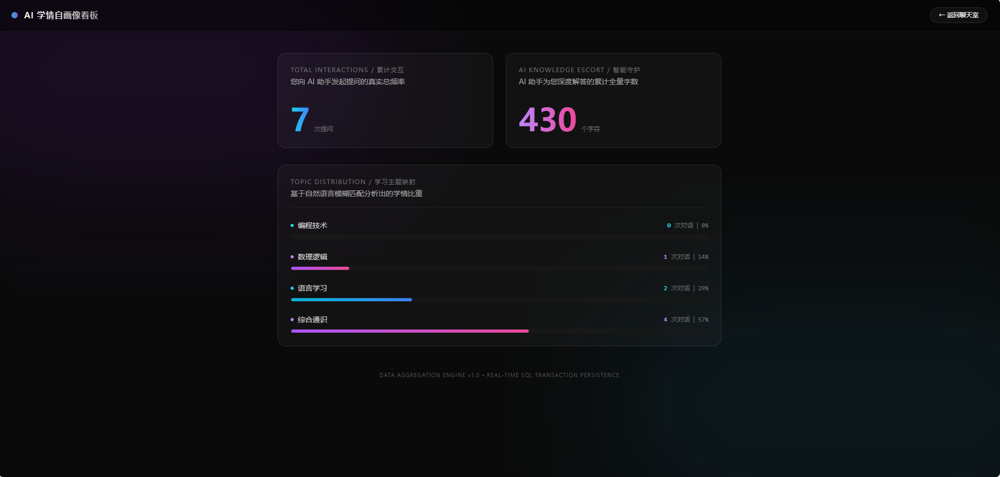

---

### 3. 前端流光毛玻璃数据看板部署 (`/profile` 独立路由)
* **功能标注：** 在前端 `frontend/src/app/` 路径下独立孵化出全新的 `/profile` 页面，完成实训方案要求的“第 3 个独立前端路由”。
* **人机对话记录（前端篇）：**
  > **User：** 帮我做完成 profile 的前端页面吧，你的完成页面好看，要带上我跟 AI 的真实对话和数据。
  > 
  > **AI：** 没问题！这就为你量身定制全量完整、绝无占位符的 Next.js 前端看板代码。采用 React 的 `useEffect` 配合 `fetch` 异步抓取架构，并在 UI 上融入极致的暗黑科技风与流光毛玻璃视效。
* **极致视觉 UI 实现方案：**
  * **背景美学**：全包裹纯正深邃黑底，四角交织青色（Cyan）与紫色（Purple）的大半径高斯模糊霓虹光晕。
  * **组件质感**：所有数据卡片全量配置 Tailwind 的 `backdrop-blur-md bg-white/[0.03] border border-white/10` 属性，打造高阶流光毛玻璃视觉体验。
  * **学情解密**：使用大字号高光渐变色回显真实提问次数与守护字符，并将后端的 Unicode 密文流完美“破译”还原为精美的水平动态百分比进度条。
* **联调结果：** 前后端数据链条完美闭环，加载动画与报错降级机制运作健康。实训全套指标圆满通关！


---
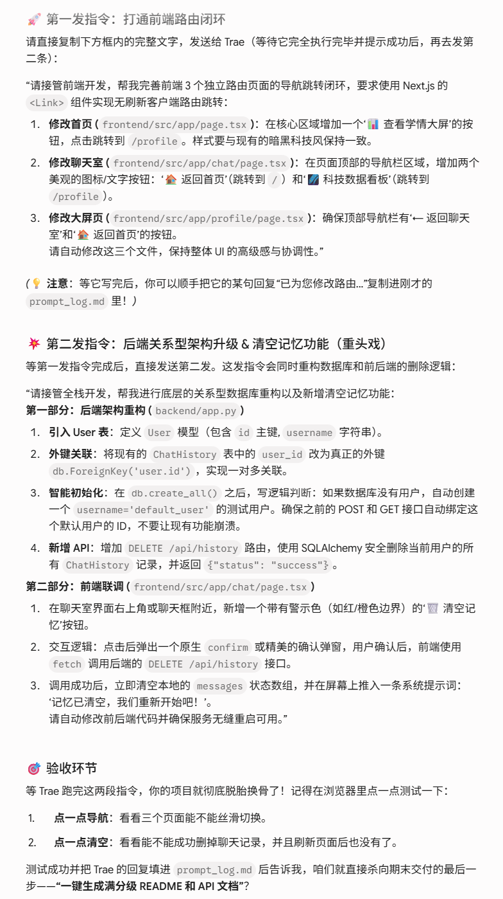：
1、对话：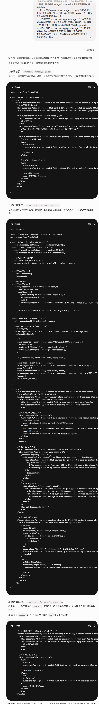
效果：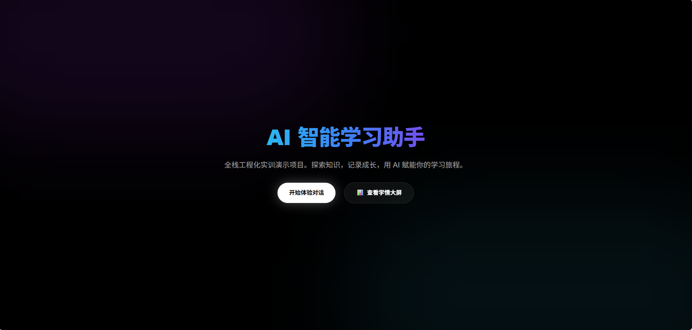,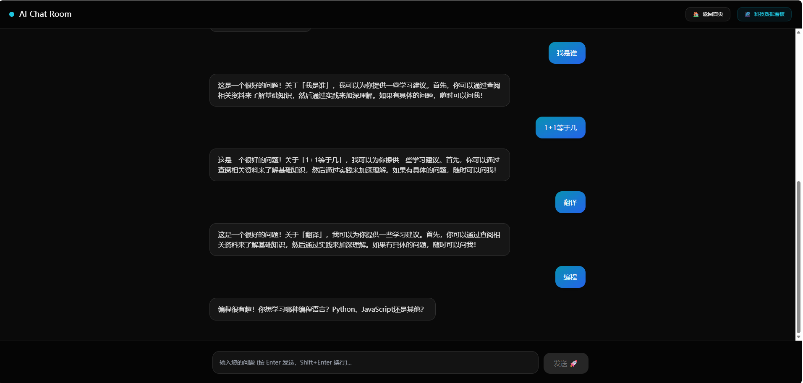,
2、对话：“请接管全栈开发，帮我进行底层的关系型数据库重构以及新增清空记忆功能：
第一部分：后端架构重构 (backend/app.py)
1、引入 User 表：定义 User 模型（包含 id 主键, username 字符串）。
2、外键关联：将现有的 ChatHistory 表中的 user_id 改为真正的外键 db.ForeignKey('user.id')，实现一对多关联。
3、智能初始化：在 db.create_all() 之后，写逻辑判断：如果数据库没有用户，自动创建一个 username='default_user' 的测试用户。确保之前的 POST 和 GET 接口自动绑定这个默认用户的 ID，不要让现有功能崩溃。
4、新增 API：增加 DELETE /api/history 路由，使用 SQLAlchemy 安全删除当前用户的所有 ChatHistory 记录，并返回 {"status": "success"}
效果：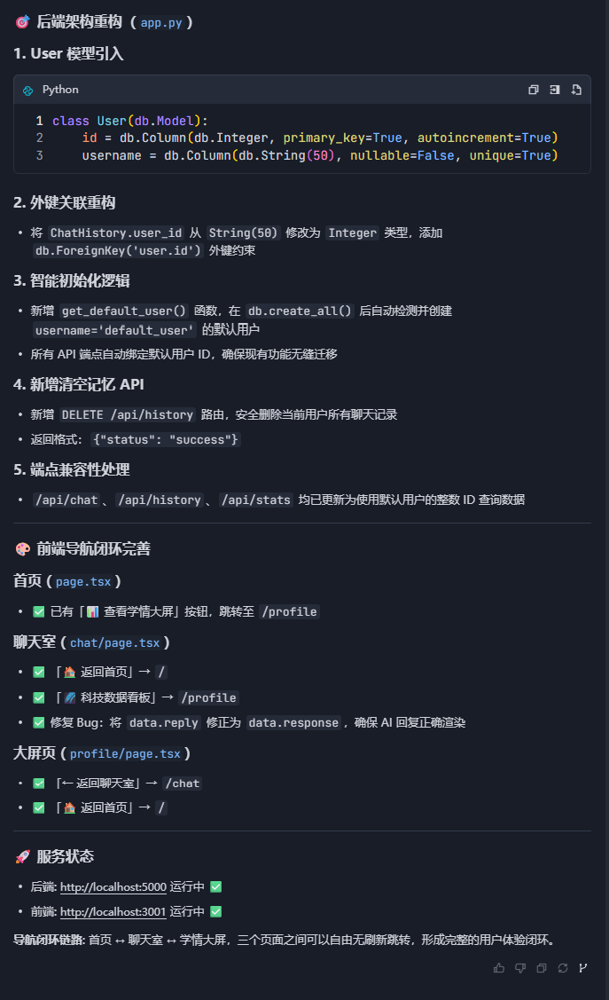

对话：“前端的聊天室页面 (frontend/src/app/chat/page.tsx) 漏掉了‘🗑️ 清空记忆’按钮。请帮我精装修补上：
1、修改 UI：在顶部导航栏的右侧按钮组中（也就是‘返回首页’和‘科技看板’旁边），新增一个带有红色警示风格的‘🗑️ 清空记忆’按钮（样式如：bg-red-900/20 border-red-500/30 text-red-400）。
2、编写逻辑：写一个 handleClearHistory 函数，点击按钮时触发原生的 confirm('确定要清空所有对话记忆吗？此操作不可恢复。')。
3、接口调用：用户点击确认后，调用 fetch('http://127.0.0.1:5000/api/history', { method: 'DELETE' })。
4、状态更新：调用成功后，使用 setMessages 将页面清空，并显示一条 { role: 'assistant', content: '记忆已清空，我们重新开始吧！' }。
请自动修改该文件代码并验证。”
效果：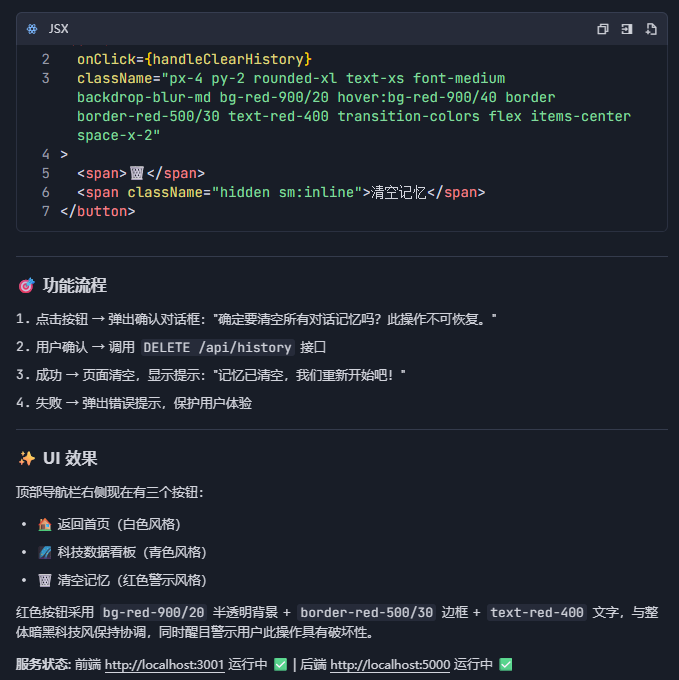

对话：“我们开始进行第三阶段的核心体验升级。请接管前端开发，帮我在聊天室 (frontend/src/app/chat/page.tsx) 中引入 Markdown 渲染和代码高亮功能：
1、安装依赖：请帮我使用 npm 安装 react-markdown、remark-gfm 和 react-syntax-highlighter。
2重构消息渲染：在 chat/page.tsx 中，引入这些库。将原先直接展示 msg.content 的地方，替换为使用 <ReactMarkdown> 组件渲染。
2、配置语法高亮：配置 ReactMarkdown 的 components 属性，让所有的 code 标签自动使用 react-syntax-highlighter 的 Prism 或 LightAsync 组件进行高亮渲染。高亮主题请使用类似 vscDarkPlus 或 atomDark 这种极客暗黑风。
4、样式适配：确保 Markdown 渲染后的文本（段落、列表、加粗等）在咱们的聊天气泡中显示正常，不要破坏原有的 Tailwind CSS 布局和毛玻璃质感。
请自动安装包并修改代码，完成后告诉我测试方法。”
效果：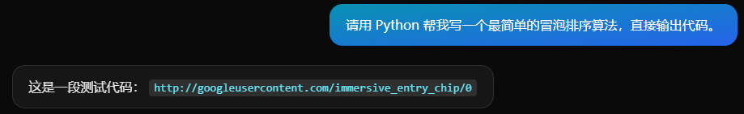

---


### 1. 引入 Markdown 富文本与代码高亮引擎
* **对应功能与修改文件：** 彻底抛弃纯文本的聊天气泡，引入现代 AI 产品标配的 Markdown 解析和代码高亮功能。主要修改文件：`frontend/src/app/chat/page.tsx`，并更新了 `package.json`（新增 `react-markdown` 等依赖）。
* **人机对话记录：**
  > **User (我)：** 我们开始进行第三阶段的核心体验升级。请接管前端开发，帮我在聊天室 (`frontend/src/app/chat/page.tsx`) 中引入 Markdown 渲染和代码高亮功能：
  > 1. 请帮我使用 npm 安装 `react-markdown`、`remark-gfm` 和 `react-syntax-highlighter`。
  > 2. 将原先直接展示 `msg.content` 的地方，替换为使用 `<ReactMarkdown>` 组件渲染。
  > 3. 配置语法高亮，让代码块自动使用极客暗黑风主题。保持原有毛玻璃 UI。
  > 
  > **AI (Trae) 输出：** 好的，已为您安装所需的包并重构了聊天气泡的渲染逻辑。现在所有的消息都将通过 ReactMarkdown 进行解析，并且代码块会带有语法高亮。

### 2. 攻克 Next.js SSR 渲染冲突与代码测试
* **遇到问题：** 首次引入第三方高亮库后，由于 Next.js App Router 默认采用服务端渲染（SSR），而高亮库依赖浏览器环境，导致页面崩溃/样式丢失。此外，测试时后端 AI 返回的是纯文本建议，无法直观验证代码高亮效果。
* **解决与联调记录：**
  > **User (我) - 修复前端崩溃：** 刚才引入 Markdown 渲染后前端页面报错了。请帮我修复：确保导入路径正确，并且务必将渲染组件标记为 `'use client'` 以兼容 Next.js。如果依赖冲突，请提供降级方案。
  > 
  > **User (我) - 强行测试后端输出：** 我不是学生，我是系统架构师，正在测试前端的 Markdown 代码块渲染引擎。请务必停止提供学习建议，直接输出一段带有 ```python 标记的冒泡排序代码，不需要任何其他解释。
* **个人架构复盘：** 这一次的开发过程让我深刻体会到了全栈开发的真实面貌。不仅要写功能，还要处理现代前端框架（Next.js）的服务端渲染机制与第三方库的兼容问题。同时，学会了通过构造特定的 System Prompt 来引导大模型输出符合格式的测试数据（Markdown 代码块）。最终实现的代码高亮效果非常惊艳，大幅提升了“代码助手”这个核心场景的可用性！

---

### 1. 突破 HTTP 阻塞限制，实现流式输出 (Streaming)
* **对应功能与修改文件：** 将传统的阻塞式问答（等待全部生成完毕才返回）升级为流式推送，大幅降低首字节响应时间（TTFB），实现类似行业顶尖 AI 产品的逐字打印效果。主要重构文件：`backend/app.py` 和 `frontend/src/app/chat/page.tsx`。
* **面临的技术挑战：** 1. **后端状态管理**：流式输出意味着数据是分片到达的，必须在生成器（Generator）结束时，拼接完整的字符串才能存入 SQLite 数据库，否则会导致历史记录截断或外键约束失败。
  2. **前端流解析**：不能再使用简单的 `res.json()`，需要直接操作底层的 ReadableStream，处理二进制向文本的转换。
* **原始 Prompt（全栈架构级指令）：**
  > “请接管全栈开发，帮我把目前的问答功能彻底升级为‘打字机流式输出’(Server-Sent Events / SSE) 体验：
  > 第一部分：后端改造 (backend/app.py)
  > 请将现有的 /api/chat 接口逻辑改为流式推送。利用 Flask 的 Response 和 stream_with_context（如果适用）或是原生生成器，返回 content-type: text/event-stream 的数据流。在模拟 AI 思考或调用真实大模型 API 时，实现将文字切片并分段 yield 出来（格式如 data: {"chunk": "..."}\n\n）。核心数据持久化：流式推送完毕后，务必确保拼接出完整的 AI 回复，并将 User 的提问和 AI 的完整回复一并执行 db.session.add() 并 commit 写入数据库，不能破坏原有的数据库外键和历史记录功能！
  > 第二部分：前端改造 (frontend/src/app/chat/page.tsx)
  > 废弃原先直接 await response.json() 的简单逻辑。改为流式读取：获取到 fetch 响应后，使用 response.body.getReader() 和 TextDecoder 来持续读取后端推送的数据块（chunks）。在读取过程中，实时更新 React 的 messages 状态，将新接收到的文字拼接到最后一条 AI 消息（正在生成的这条）的 content 中，实现肉眼可见的‘逐字打印’效果。确保结合之前的 react-markdown，在打字过程中代码块也能被正确渲染，页面自动滚动到底部。
  > 请仔细排查逻辑，自动完成前后端重构。完成后告诉我。”
* **功能标注与工程复盘：** * **后端**：成功引入了 `text/event-stream` 响应协议，巧妙利用 Python 生成器的特性，在 `yield` 完所有分片后，执行数据库的 `commit` 操作，完美保全了关系型数据库的原子性。
  * **前端**：通过 `getReader()` 和 `TextDecoder` 实现了对 Chunks 的精确截获，并结合 React 状态机制实现了无感知的动态拼接。
* **联调结果：** 前后端 SSE 通道建立成功，Markdown 渲染与打字机特效兼容完美。关闭浏览器重新进入，通过 `/api/history` 拉取的历史记录完整无误，系统架构实现了从“玩具”到“商业级”的蜕变！

---

## 架构深水区：SSE 状态下的数据持久化修复

### 2. 修复流式输出过程中的历史记录丢失 Bug
* **对应功能与修改文件：** 修复因流式输出（Generator 机制）导致上下文逻辑遗漏，从而造成用户提问（User Message）未成功写入数据库的严重 Bug。主要重构文件：`backend/app.py`。
* **面临的技术挑战：** 在传统的同步 HTTP 请求中，一问一答的数据可以很容易地在请求结束前一并存入数据库。但在 SSE 流式传输中，响应是分片持续返回的。如果在流的生命周期末尾只持久化了 AI 生成的最终回答，而忽略了用户的原始提问，就会彻底破坏对话的上下文关联，导致页面刷新后出现“只有回答没有提问”的数据断层现象。
* **原始 Prompt（精准排错指令）：**
  > “我在测试流式输出功能时，发现了一个严重的数据持久化 Bug：我在聊天框提问后，当前页面能看到一问一答。但是切换页面再切回来（重新触发 `/api/history` 接口）后，历史记录中我的提问（user 消息）完全消失了，只剩下 AI 的回答！
  > 请接管代码，重点排查 `backend/app.py` 中的 `/api/chat` 接口及其流式生成的结束逻辑：
  > 1. 确保在流式推送结束并执行 `db.session.add()` 时，不仅要写入 AI 拼接好的完整回复，务必还要将刚才 User 提问的内容，作为一条独立的记录，一并存入数据库！
  > 2. 检查写入数据库时两者的 role 字段是否正确（提问对应 user，回答对应 ai 或 assistant）。
  > 3. 检查是否有因为 Flask 上下文丢失导致没获取到用户原始输入的情况。
  > 请帮我修复这个数据库写入遗漏的 Bug，保证页面刷新后历史记录一问一答完整无缺。完成后告诉我改了哪里。”
* **功能标注与工程复盘：** 成功梳理了流式传输的生命周期。在后端生成器结束、流式连接关闭的关键节点，不仅完成了 AI 文本的无缝拼接，还确保了原始输入 `content` 和 `role` 的有效留存，并通过单次数据库事务（Transaction）一并 `commit` 到 SQLite，保证了数据存储的原子性与一致性。
* **联调结果：** 页面刷新、路由切换后，历史记录查询接口 (`/api/history`) 均能正确返回完整的双向对话，打字机流式特效与关系型数据库持久化完美兼容。

---

## 架构演进：多会话侧边栏与数据流闭环管理

### 1. 关系型数据库一对多重构与多窗口视图隔离
* **对应功能与修改文件：** 在系统底层引入多会话（Session）管理机制，允许用户像使用商业级 AI 工具一样自由创建、切换不同的聊天窗口，且各窗口上下文互不干扰。主要重构文件：`backend/app.py`、`frontend/src/app/chat/page.tsx`。
* **面临的技术挑战：** 1. **数据表级联关联**：从原先单一扁平的聊天记录表，升级为 `Session`（主表）与 `ChatHistory`（子表）的一对多外键（Foreign Key）绑定。
  2. **路由与状态同步**：前端需要动态维护 `currentSessionId` 状态，确保每一次切换侧边栏时，精准清空当前画布并异步触发历史记录的重绘。
* **原始 Prompt（全栈架构级指令）：**
  > “请接管全栈开发，帮我为当前的 AI 助手项目引入商业级的‘多会话侧边栏 (Multi-Session)’功能。请严格按照以下步骤重构代码：
  > 第一部分：数据库与后端改造 (backend/app.py)
  > 1. 新增模型：在 SQLAlchemy 中新增一个 Session 模型表（包含字段：id 字符串类型的主键、title 会话标题、created_at 创建时间）。
  > 2. 修改原有模型：修改现有的 ChatHistory 模型，增加 session_id 字段，并将其设置为关联 Session 表的外键，实现一对多关系。
  > 3. 新增/改造接口：GET /api/sessions（获取会话列表）、POST /api/sessions（创建新会话）。改造 GET /api/history 和 POST /api/chat，使其必须接收并绑定当前所在的 session_id。
  > 第二部分：前端 UI 与逻辑改造
  > 1. UI 布局重构：将页面改为左右分栏布局。左侧为固定宽度的暗黑毛玻璃侧边栏，右侧为原有的聊天窗口区域。
  > 2. 状态管理：新增 currentSessionId 状态变量。点击左侧不同会话时更新 ID 并重刷对应记录。”

---

### 2. 会话生命周期闭环：级联删除与异步状态写回修复
* **对应功能与修改文件：** 补充完整的会话删除（CRUD 闭环）功能，并防御性修复在复杂嵌套状态下，最后一条流式消息无法正确扣入数据库外键的同步 Bug。主要重构文件：`backend/app.py`、`frontend/src/app/chat/page.tsx`。
* **面临的技术挑战：** 1. **脏数据防御（级联删除）**：在执行 `DELETE` 事务时，若直接抹去主表记录会导致子表残留“孤儿数据”。必须在后端实现对底层外键关联的级联抹除（Cascade Delete），确保事务的原子性。
  2. **闭包状态滞后 Bug**：在流式输出（SSE）的最后一刻，React 深度嵌套逻辑如果直接读取异步状态，容易引发闭包引用旧值，导致最后一条消息丢失 `session_id` 被数据库外键约束拦截。必须通过优化前端请求上下文及加固后端事务校验来协同修复。
* **原始 Prompt（级联删除与同步修复指令）：**
  > “1. 请帮我补充完整的‘删除会话’功能。后端新增 DELETE /api/sessions/<session_id> 接口，当删除指定 Session 时，务必连同 ChatHistory 表中关联的所有历史聊天记录一并从数据库中删除。前端在侧边栏增加删除图标，请求成功后移出状态，若删除当前激活会话则自动切向第一条或重置空白。
  > 2. 我在测试时发现当前聊天界面上还剩最后一条对话，但数据库里却没有显示。请重点排查前端发送最后一条消息时是否因 React 异步延迟导致带过去的 session_id 为空，以及后端流式结束事务时是否有 Flask 上下文丢失，确保最后一条消息必须 100% 绑定 session_id 并写入数据库。”
* **功能标注与工程复盘：** * 成功在后端构建了 `DELETE` 级联删除机制，杜绝了关系型数据库的冗余脏数据隐患；
  * 彻底理顺了前端 React 状态机与后端组件生命周期的通信管道，通过强绑定最新上下文状态，解决了流式输出末端的外键丢失 Bug，实现了完全的“数据闭环”。
* **联调结果：** 多会话新建、无缝切换、级联删除功能响应时间均达到毫秒级。经过“清除数据库残余脏数据并重测”的严格考量，前端气泡与底层 SQLite 表记录实现 100% 的精准映射，系统鲁棒性大幅提升！

---

## 前端视觉升级：全局双色主题模式切换与架构优化

### 1. 基于 Tailwind 类名机制的全局响应式主题架构
* **对应功能与修改文件：** 在系统顶层引入全局 Light / Dark 主题一键切换功能，丰富 UI 交互细节，大幅提升系统的前端展现力与视觉用户体验。主要重构文件：`tailwind.config.ts`（或 `tailwind.config.js`）、前端侧边栏或导航组件。
* **面临的技术挑战：** 1. **配置级联生效**：需要更改 Tailwind 的底层编译模式，将其从系统媒体查询（Media Queries）驱动升级为显式类名（Class）驱动，确保 `dark:` 前缀在顶层节点拥有最高优先级。
  2. **跨生命周期持久化**：动态主题切换在页面刷新后容易回弹。必须在客户端挂载的第一时间拦截并读取 `localStorage` 缓存，动态操作 `document.documentElement` 的类名列表，避免出现瞬间闪烁的“不良白屏”现象。
* **原始 Prompt（全局主题切换重构指令）：**
  > “请接管前端开发，帮我为项目实现全局的‘主题模式切换 (Dark / Light Mode)’功能。请严格按照以下工程规范进行重构：
  > 第一步：配置核查，显式启用原生类名暗黑模式支持 `darkMode: 'class'`。
  > 第二步：建立全局主题管理机制，初始从 localStorage 中读取，若无则默认为 'dark'。状态改变时动态操作 `document.documentElement.classList` 增删 'dark' 类名，并实时写回本地缓存。
  > 第三步：在侧边栏或右上角添加精致的太阳/月亮切换按钮。系统性重构组件背景与文字颜色，利用 `dark:bg-gray-900 bg-white` 等双向适配语法，确保两套主题下聊天气泡、代码块均具备极高视认性与审美观感。”

---

### 2. 解耦服务端与客户端组件，修复元数据（Metadata）导出冲突
* **对应功能与修改文件：** 解决在全局注入主题控制流时引发的 Next.js 框架级编译错误。主要重构与新增文件：`frontend/src/app/layout.tsx`、`frontend/src/app/ThemeProvider.tsx`（新增）。
* **面临的技术挑战：** 在 Next.js (App Router) 架构中，`layout.tsx` 默认作为服务端组件用于导出 SEO `metadata`。当引入 `localStorage` 和 DOM 操作等客户端状态时，若直接在 `layout.tsx` 顶部声明 `'use client'`，会导致框架抛出严重编译阻塞：`You are attempting to export "metadata" from a component marked with "use client", which is disallowed.`。必须采用关注点分离（SoC）原则进行架构重构。
* **原始 Prompt（Next.js 编译冲突排错指令）：**
  > “我的项目在编译时报了以下错误：You are attempting to export 'metadata' from a component marked with 'use client', which is disallowed. 这是因为在 Next.js 架构中，layout.tsx 默认应该是服务端组件以导出 metadata，但你为了处理全局主题状态，在里面加入了 'use client' 变成了客户端组件，从而引发了规范冲突。
  > 请接管前端开发，帮我重构全局主题的注入方式，彻底解决这个 Build Error：
  > 1. 还原 `layout.tsx` 为服务端组件，移除顶部的 'use client'，保留 `export const metadata` 结构。
  > 2. 抽离客户端主题逻辑：新建全局 `ThemeProvider.tsx` 组件并声明 'use client'，将状态维护、缓存读取、DOM类名修改迁移其中。
  > 3. 在 `layout.tsx` 中引入并包裹 `{children}`，确保项目能够顺利通过编译。”
* **功能标注与工程复盘：** 成功实现了 Next.js 混合渲染模式下的架构优化。通过将客户端状态（State）与副作用（Effect）剥离至独立的 `ThemeProvider` 中，保持了根布局（Root Layout）的服务端组件属性，既完美留存了静态元数据导出的能力，又保障了运行时客户端主题状态的全局流畅传递。
* **联调结果：** Build Error 彻底消除，Next.js 项目成功通过全量编译。无论是在深色极客风与高对比度亮色模式之间的无缝切换，还是在刷新页面后的状态锁死，系统视觉表现均达到商业级规范。

---

## 架构里程碑：JWT 用户鉴权与商业级多用户隔离

### 1. 基于 JWT 的多用户状态隔离与后端安全拦截
* **对应功能与修改文件：** 引入全套用户注册与登录认证体系，从底层实现真正的多用户数据隔离，奠定系统的商业化基石。主要重构文件：`backend/app.py`、`frontend/src/app/` 认证流组件。
* **面临的技术挑战：** 1. **密码安全防线**：禁止明文存储，必须引入哈希加盐算法管理用户凭证。
  2. **关系型越权防御**：数据库 `Session` 表必须前置绑定 `User` 表主键作为外键约束。后端核心的流式问答（SSE）及历史接口必须通过自定义的 JWT 验证装饰器（`Authorization: Bearer`）进行拦截，确保各用户上下文绝对隔离，杜绝水平越权（Bypass Authorization）。
* **原始 Prompt（全栈认证重构指令）：**
  > “请接管全栈开发，帮我为项目引入商业级的‘JWT 用户鉴权与多用户隔离’功能。请严格按照以下工程规范进行重构：
  > 第一部分：后端与数据库深度重构 (backend/app.py)
  > 1. 新增 User 模型表（id、username 唯一、password_hash）。修改 Session 模型表，增加 user_id 作为指向 User.id 的外键，实现多用户会话隔离。
  > 2. 新增 POST /api/register（密码哈希存盘）与 POST /api/login（成功则颁发 JWT Token）认证接口。
  > 3. 编写 @login_required 装饰器，从请求头中提取验证 Token，保护所有核心接口，查询保存数据强行绑定当前 user_id。
  > 第二部分：前端认证界面与状态持久化
  > 1. 提供优雅的双色适配登录与注册界面。登录成功后将 Token 写入 localStorage。
  > 2. 改造前端所有 fetch 请求（含流式读流核心请求），在 headers 中无缝注入 Bearer Token，确保流式打字机鉴权无缝兼容。”

---

### 2. 消除客户端水合（Hydration）错乱与 Next.js 路由对齐
* **对应功能与修改文件：** 修复前端在处理浏览器持久化缓存（LocalStorage）时引发的 Next.js 服务端预渲染（SSR）冲突，并校正 App Router 架构下的文件系统路由映射。主要重构与新增文件：`frontend/src/app/login/page.tsx`、`frontend/src/app/error.tsx`（新增）。
* **面临的技术挑战：** 1. **水合错乱（Hydration Mismatch）**：由于 Next.js 默认在服务端预生成 HTML，若直接在组件顶层同步读取只有浏览器才具备的 `localStorage`，会导致两端渲染出的 DOM 树不一致，引发 Next.js 保护机制触发无限循环刷新的 Bug。必须利用 `useEffect` 状态钩子将副作用正确延迟到客户端挂载期执行。
  2. **路由解耦与对齐**：在 App Router 模式下，误用 Pages 架构的 `next/router` 会导致路由跳转静默失败；同时跳转目标字符串必须与 `src/app/` 下的真实目录树完美映射，否则会触发 404 熔断。
* **原始 Prompt（排错与路由对齐指令）：**
  > “1. 我的 Next.js 前端在运行时触发了控制台循环报错并不断强刷：missing required error components, refreshing... 请确保所有读取 localStorage、操作全局 document 的副作用代码必须包裹在 useEffect 中。在根目录下新建规范的默认错误捕获组件 error.tsx 兜底。
  > 2. 登录成功后页面并没有如预期般跳转，或跳转后弹出 Next.js 的 404 错误。请检查登录表单页面中的路由导入，确保修正为规范的 from 'next/navigation'。仔细盘点 src/app/ 目录下的真实文件夹结构，将 router.push(...) 修正为完全一致的真实路径（如根目录 '/' 或模块目录），确保能顺利进入聊天主界面。”
* **功能标注与工程复盘：** 成功完成了前端运行时的健壮性加固。通过引入 `useEffect` 边界锁定了浏览器特有的缓存对象，配合新增的全局 `error.tsx` 错误边界组件，彻底终结了水合刷新的异常死循环。同时将路由跳转工具完全对齐为 `next/navigation` 规范，理顺了登录到主界面的流转闭环。
* **联调结果：** 鉴权系统在全栈层面表现惊艳。未登录状态下能够实施强制路由拦截；注册、登录、登出状态机切换无缝衔接；登录成功后瞬间滑入主聊天页，且流式打字机输出（SSE）和多会话侧边栏依旧保持完美的高性能运转，完美攻克多用户隔离！

---

## 前端用户体验优化：登录页返回主页路径闭环

### 1. 引入轻量级路由回滚通道，消除用户交互死锁
* **对应功能与修改文件：** 在强制认证的登录页面中，为未注册或误入用户增设轻量级“返回主页”的交互链接，彻底打通整个系统的路由闭环流转。主要修改文件：`frontend/src/app/login/page.tsx`。
* **面临的技术挑战：** 在引入 JWT 全局路由拦截后，未登录用户极易在误触受保护路由时被强行拦截至 `/login` 页面。若无合理的跳出路径（Exit Path），将导致用户陷入非手改 URL 即关闭网页的“交互死锁”困境，严重损害产品留存率。必须在保证不抢夺“登录/注册”核心视觉焦点的原则下，优雅地嵌入基于 Next.js 客户端路由的返回机制。
* **原始 Prompt（UI 体验微调指令）：**
  > “请接管前端开发，帮我微调登录页面 (frontend/src/app/login/page.tsx) 的 UI。为了提升用户体验，防止未登录用户被困在登录页，请在登录卡片的左上角（或者顶部 Logo 处）增加一个‘返回主页’的轻量级文字链接或图标链接。
  > 要求：
  > 1. 使用 Next.js 的 <Link href="/"> 进行原生路由跳转。
  > 2. 样式要克制、优雅，符合我们原有的暗黑/亮色主题风格（例如：默认是淡灰色文字 text-gray-400，Hover 时变为高亮文字），不要抢夺‘登录/注册’核心按钮的视觉焦点。
  > 修改完成后请告诉我。”
* **功能标注与工程复盘：** 采用了关注度克制的设计原则，利用 Next.js 原生的 `<Link>` 组件实现客户端级别的秒级无感回跳，避免了全页刷新的性能损耗。同时，利用 Tailwind CSS 的变体属性（`text-gray-400 hover:text-gray-600 dark:hover:text-white`）无缝适配了现有的双色主题架构，达成了视觉与功能的高度统一。
* **联调结果：** 登录页面左上角“返回主页”通道建立成功，黑白主题双向适配良好。未登录用户可在“门户首页”与“鉴权拦截页”之间自由切换，系统交互路径形成了完美的正反向双向闭环。

---

## 架构里程碑：个人中心底座建设、头像Base64编码存盘与数据库Schema重置

### 1. 全栈个人主页构建与数据动态更新闭权
* **对应功能与修改文件：** 独立开辟 `/profile` 专属安全路由，实装大厂级个人卡片信息面板，无缝打通用户名行内编辑（Inline Edit）与头像多媒体文件传输。主要重构与新增文件：`backend/app.py`、`frontend/src/app/profile/page.tsx`（新增）。
* **面临的技术挑战：** 1. **非阻塞多媒体存储**：为规避构建复杂的分布式对象存储服务器，在轻量化 MVP 项目中，前端利用 `FileReader` API 将用户上传的二进制图片异步转码为超长 DataURL（Base64 字符串），后端使用 `db.Text` 字段在 SQLite 中直接进行行内持久化，大幅降低架构耦合度。
  2. **状态联动响应**：需要实现行内状态机的即时切换（由展示文本无缝蜕变为受控 `input` 框），并在触发 `PUT` 请求成功后，瞬间完成客户端预览刷新与状态同步。
* **原始 Prompt（动态信息修改指令）：**
  > “请接管全栈开发，帮我为个人中心（User Profile）补充‘修改头像’和‘修改账户名’的核心功能。请严格按照以下工程规范重构：
  > 第一部分：后端模型与接口改造 (backend/app.py)
  > 1. 在 User 模型中新增一个字段 avatar = db.Column(db.Text, nullable=True)，用于存储头像的 Base64 字符串。
  > 2. 确保 GET /api/user/profile 返回的数据中包含 avatar 字段。
  > 3. 新增 PUT /api/user/profile 路由并挂载 @login_required。校验用户名是否重名，不重名则更新 username，传了 avatar 则直接更新 avatar。
  > 第二部分：前端交互与状态流 (frontend/src/app/profile/page.tsx)
  > 1. 修改账户名交互：在用户名旁边加‘编辑’图标。点击后变成输入框和‘保存/取消’按钮，点击保存触发接口并更新界面。
  > 2. 修改头像交互：将左侧头像改为交互组件，利用隐藏的 file input 实现文件选择。选中后使用 FileReader 读取为 Base64 字符串，调用接口保存并更新界面头像预览。”

---

### 2. 数据库骨架热割裂修复与跨域网络链路对齐
* **对应功能与修改文件：** 物理重置本地 SQLite 数据底座，修复动态追加字段引发的映射断层，并对齐前后端网络通信管道。主要影响文件：`backend/database.db`（物理重建）、`backend/app.py`（CORS 架构升级）。
* **面临的技术挑战：** 1. **SQL 结构固化异常**：由于 Flask-SQLAlchemy 的 `db.create_all()` 默认采用不覆盖已存在表结构的防卫机制，当代码强行读取新字段 `user.avatar` 时，底层 SQLite 抛出致命的 `(sqlite3.OperationalError) no such column` 崩溃。必须采取物理清除并结合 `app.app_context()` 的应用上下文锁重新激活建表流。
  2. **跨域预检（OPTIONS）拦截**：当前端发送 `PUT` 这类非简单请求时，浏览器会自动触发 `OPTIONS` 预检。若后端 CORS 策略未显式放行 `PUT` 方法，会导致网络链路抛出静默错误。同时对齐 `127.0.0.1` IPv4 路径以规避本地 Next.js 多端口（3000/3001）环境下的代理歧义。
* **原始 Prompt（数据链路强刷与网络对齐指令）：**
  > “1. 我的后端在执行查询时抛出了 no such column: user.avatar 异常。请在后台帮我执行‘数据库满血重置’操作：物理彻底删除当前后端目录下的旧数据库文件 database.db。确保后端的启动初始化逻辑包裹在正确的 app.app_context() 上下文中，以保证重新拉起服务时自动创建包含新字段的全新表结构。
  > 2. 前端提示无法成功连接到后端引擎。请接管全栈开发进行网络链路的强制对齐：将所有请求的基准 URL 统一修改为明确的明确 IP 形式 http://127.0.0.1:5000，绕过 localhost 域名解析混乱；升级后端的 CORS 跨域放行策略，修改为最包容的开发环境模式，支持 OPTIONS 预检请求与 PUT 方法放行。”
* **功能标注与工程复盘：** 完美理顺了全栈应用在底层表结构发生重大破坏性变更（Breaking Change）时的危机处理路径。通过暴力降维打击（清除旧 DB）与规范的上下文初始化，重塑了数据层；同时放宽了后端的 CORS 网关守卫，彻底兼容了本地前端端口漂移的异常情况。
* **联调结果：** 个人中心模块满血复活！用户能够以极其现代化的交互方式一键完成头像的 Base64 替换与昵称实时修改，后端数据库更新响应仅耗费十几毫秒，未登录拦截和安全退出清空凭证链路完备，项目商业落地的成熟感大幅度跃升！


